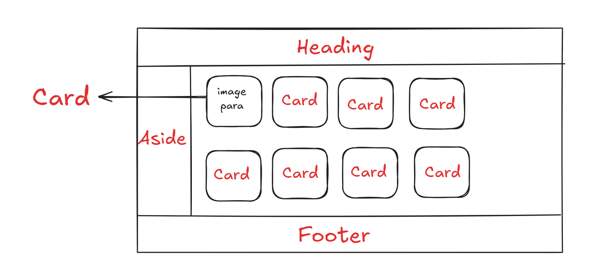
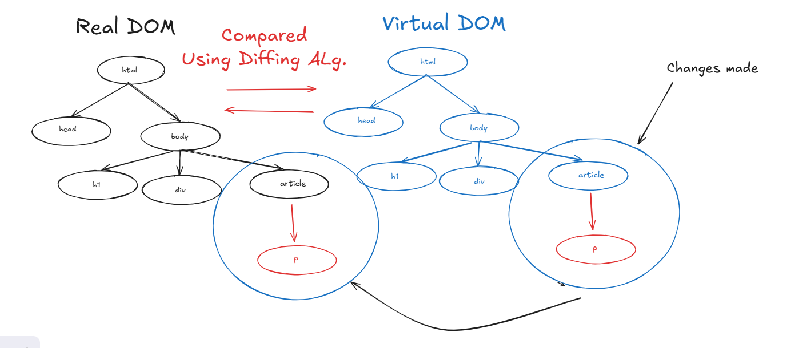

# Reactjs

## Intro

### * React is a *JavaScript library* for building user interfaces

| Library | FrameWork|
|---------|---------|
| A collection of functions which you can use however you want | A collection of libraries|
| No proper syntax, no proper rules | Has a proper syntax and rules|
| Doesnt provide you with everything| Provides you with everything|
| Needs additional libraries | Doesnt need additional frameworks |
| Eg. Reactjs|Eg. Angular, Tailwind |

### * Used to create *Single page applications*

| Single page | Multipage|
|------------|---------|
| Has a **single** html page | Has **multiple** HTML files, navigates from one file to another|
| requests are **continuous**| requests always **start from zero** |
| Renders **different data** based on some **conditions** | Needs to **fetch multiple** HTML pages |
| Not Search Engine Optimized | Search Engine Optimized |
| **Takes much time** to load at the **start**, then its faster than multi page| Same loading speed for all pages |

### * Single Page Application idea in 2002

### * 2009 Angularjs was created as the first single page application, but had so many bugs and errors (also didnt have a component based Arch.)

### * Reactjs was created in 2011 by Facebook with the dev Jordan Walke

### *  But was tested and was open-sourced in the year 2013 for public use

## Characteristics

- free and open source

- is a JS Library

- Component based arch. -> dividing webpage into components and call them when required



- Declarative -> no need to specify each and every step to perform a task

- Unidirectional -> data only flows from parent to child

- Learn Once, write anywhere -> can use it for mobile, web apps

- Virtual DOM(Diffing Algo.) -> a copy of the actual DOM, adding any component will be done on Virtual DOM. Then the VDOM will be compared with the Real DOM and only the changes will be applied on the Real DOM. The complete process is called ***Reconcilation***

### * DOM -> Tree like stucture of the web page

## Virtual DOM



### * Exact Copy of real DOM

### * A real dom is created by the browser

### * Virtual DOM is created by Reactjs

### * Changes are made on the Virtual DOM first, then using Diffing algorithm the changes are identified and applied on the Real DOM

### diffing -> comparing real dom with the virtual DOM

## Creating a react App

### Go to src folder and create a folder named **main.jsx**

### perform these steps

```jsx

import React from "react"
import ReactDOM from "react-dom/client"

ReactDOM.createRoot(document.getElementById("root")).render(<h1>Hello</h1>) //Creating the root element by selecting it from the index.html using getElementById() and rendering the h1 tag
```

### **Creating a React Element using createElement()**

```jsx
let obj = React.createElement("h1", {id:"first"}, "Created using React createElement")
ReactDOM.createRoot(document.getElementById("root")).render(obj) //Creating the root element by selecting it using getElementById()

```

## Rules of JSX

### * Since the above method is complecated, we use .jsx

### * JSX elements must be closed

### * JSX expressions must have one parent element

### * to provide class, use className in JSX, to provide 'for' attribute is 'htmlFor' as 'class' is a keyword in JS

### * inbuilt tags must be in lower case, attributes must be in camel case

### * custom tags must me in Pascal case

### * Use {} for javascript expression

## React Fragment

### ``<React.Fragment>`` is used for enclosing multiple elements as, creting sections and divs unnecessarily, creates extra nodes, which is bad for performance

### An alternate for that is ``<></>`` empty fragment

## * Using JS in JSX

### * We use JS expressions inside a `{}`

### * We can pass number, string and array

### * We can use those JS expressions that can return a value

### * We cant use bool, null and undefined types

### `filter()`, `map()` and `ternary operators` could be used in JSX Expressions

## Components

### * a reusable, independent, js functions that can be used multiple times within an application

### * Components allows us to break down the UI into smaller parts

### * In 2019, React introduced "React Hooks", which made function based components stateful

## Types of Components

1. Function Based Component

2. Class Based Component

## Creating Components

1. Create them in the ``src`` folder - must be a JSX file

2. The first alphabet of the file name must be in caps Eg ``App.jsx``

3. Syntax may be class or function based

4. Then export your component

5. And import it with proper address whenever you want and use custom defined tag (wraped inside angular braces)

### * Component composition -> calling the user defined component using tags Eg `<App/>`

## Props

### * To make our components dynamic, we provide it with properties

### * We pass arguments to components

### * The arguments are passed as a **single object**

### * When **Props**, **except string**, use **curly braces** to enclose it

### * We use unpaired tags to give objects, paired tags to give props to other components as **children**

### Props are **read-only **

### Parent Component:

```jsx  

const Form = () => {
  let Name = "John"
  let Age = 20
  return (
    <React.Fragment key={1}>
            <form action="" className=' p-10'>
            <h1 className='text-3xl font-semibold'>Form</h1>
                <fieldset className='flex gap-4 py-5'>
                    <label htmlFor="name" className='text-lg' name={Name}>Enter you Name</label>
                    <input type="text" className='border rounded-sm' /><br></br>
                    <label htmlFor="name" className='text-lg'>Enter you Age</label>
                    <input type="number" className='border rounded-sm'/>
                </fieldset>
            </form>
            <Info name = {"John"} age={20}/>
        </React.Fragment>
  )
}

```

### Child Component:

```jsx

const Info = (props) => {
    console.log(props)
    const person = {
        Name: props.name,
        Age: props.age,
        Skills: ["HTML ", "CSS ", "JavaScript"]
    }

    return (
        <div className="flex flex-col gap-7 p-10">
            <h1 className='text-4xl font-semibold'>Info</h1>
            <h1>Name: {person.Name}</h1>
            <h1>Age: {person.Age}</h1>
            <h1>Skills: {person.Skills}</h1>
        </div>
    );
};

```

### Passing props as JSX element

#### Parent Component

```jsx

PropsChildren>{<Info name = {"Usopp"} age={Person.Age} hobbies={Person.Hobbies} favGames={Person.FavGames} knownLang={Person.KnownLang} addr={Person.Addr} eat={Person.eat} play={Person.play} sleep={Person.sleep}/>}</PropsChildren>

```

#### Child Component

```jsx

const PropsChildren = (props) => {
    console.log(props.children)
  return (
    <div>{props.children}</div>
  )
}


```